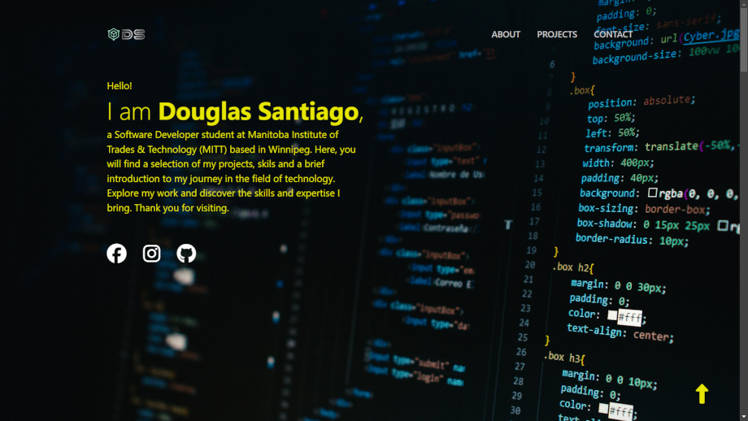
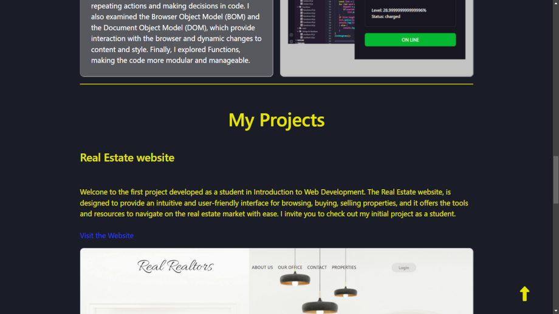

# Portfolio

This project highlights my journey and growth as a web developer, showcasing a variety of skills in HTML, CSS, and JavaScript. The portfolio is a reflection of my learning process, encompassing the essential building blocks of web development and creative design.

Visit the website [here](https://douglasfssantiago.github.io/student-portfolio/)



## Features 

This project showcases cutting-edge web development practices, blending visual 
appeal with functional responsiveness. Developed using the latest HTML5 and 
CSS3 standards, it emphasizes clean, accessible code and adaptable layouts 
that smoothly transition across various devices. Key design features include:

* Responsive Design: Ensures optimal viewing experience across different devices, 
from desktops to mobile phones.
* Dynamic Interactions: JavaScript-powered functionalities for a more engaging 
user experience.
* Semantic HTML: Clean and well-structured code for improved accessibility and SEO.
* Styled with CSS: Modern and visually appealing layouts using Flexbox, 
media queries, and more.
* Interactive Elements: Forms, buttons, and other elements to enhance user 
interaction.


 
## Get Started

**To get started locally:**

Clone this repo:

```bash
git clone https://github.com/douglasfssantiago/student-portfolio.git
cd real-realtors-project
```
Explore the different files.

Select the index.html file.

Do right-click and select the `Reveal in File Explorer` menu.

Double-click on file index.html.

Through the top menu, you can navegate to the other web pages, such as 
About us and Contact us:
<br/>